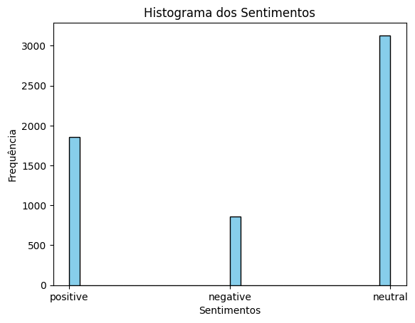

# Análise de Sentimentos

## 1. Análise Exploratória dos Dados

### **Descrição dos Dados:**
  
  Os dados utilizados neste projeto consistem em um conjunto de textos classificados quanto ao sentimento associado. Cada entrada no conjunto de dados possui um texto associado e uma etiqueta indicando se o sentimento é positivo, negativo ou neutro.

  Algumas estatísticas básicas sobre o conjunto de dados:

- Número total de sentenças: 5842
- Número de sentenças positivas: 1852
- Número de sentenças negativas: 860
- Número de sentenças neutras: 3130

### **Visualização de Dados:**
  
  
  
  
  
  

## 2. Tratamento dos Dados

Para garantir a qualidade e consistência dos dados utilizados na análise de sentimentos, foram aplicadas diversas etapas de pré-processamento. Essas etapas visam limpar os textos, converter para um formato uniforme e preparar os dados para serem alimentados em modelos de análise de sentimentos.

### **Limpeza de Dados**

- **Conversão para Minúsculas:**
  - Todos os caracteres nos textos foram convertidos para minúsculas. Isso é feito para garantir consistência e evitar a diferenciação entre palavras em maiúsculas e minúsculas.

- **Remoção de Caracteres Especiais:**
  - Foram removidos caracteres que não são alfanuméricos ou espaços em branco. Isso inclui pontuações e outros símbolos que podem não contribuir para a análise de sentimentos.

- **Remoção de Números:**
  - Todos os dígitos foram removidos dos textos. Isso é feito para eliminar números que podem não ser relevantes para a análise de sentimentos.

- **Remoção de Quebras de Linha:**
  - Quebras de linha e retornos de carro foram removidos para garantir que o texto esteja bem formatado e não contenha caracteres de nova linha que possam interferir no processamento.

### **Conversão de Rótulos de Sentimento**

Os rótulos de sentimento foram mapeados para valores numéricos para facilitar o treinamento e avaliação de modelos de análise de sentimentos.

- "positive" foi mapeado para 1.
- "negative" foi mapeado para 0.
- "neutral" foi mapeado para 2.

Essa conversão permite que os modelos lidem mais eficientemente com os rótulos durante o treinamento e a avaliação.

### Resultado do Tratamento

Após a aplicação dessas etapas de pré-processamento, os dados estão prontos para serem utilizados no treinamento e avaliação de modelos de análise de sentimentos. A coluna "Sentence" foi completamente tratada, e os rótulos de sentimento agora são representados por valores numéricos, facilitando a aplicação de algoritmos de aprendizado de máquina.

## 3. Seleção, Treinamento e Otimização do Algoritmo

- **Escolha do Algoritmo:**
  - Justificativa para a escolha do algoritmo de análise de sentimentos.
  - Explicação sobre como o modelo foi selecionado com base nas características dos dados.

- **Treinamento do Modelo:**
  - Descrição do processo de treinamento, incluindo hiperparâmetros utilizados.
  - Discussão sobre o conjunto de treinamento, validação e teste.

- **Otimização:**
  - Estratégias adotadas para otimização do desempenho do modelo.
  - Ajuste de hiperparâmetros e validação cruzada, se aplicável.

## 4. Análise de Importância de Variáveis e Interpretabilidade

- **Importância de Variáveis:**
  - Métodos utilizados para avaliar a importância das variáveis no modelo.
  - Discussão sobre as características mais influentes na análise de sentimentos.

- **Interpretabilidade do Modelo:**
  - Técnicas adotadas para tornar o modelo mais compreensível.
  - Visualizações ou abordagens específicas para entender as decisões do modelo.

## 5. Validação dos Resultados e Performance do Algoritmo

- **Avaliação das Novas Sentenças:**
  - Para testar a capacidade de generalização do modelo, um conjunto de novas sentenças é criado. Essas sentenças são convertidas em vetores usando o mesmo método de vetorização previamente treinado.
  - As novas sentenças vetorizadas são submetidas ao modelo treinado para análise de sentimento. As previsões resultantes são examinadas para avaliar se o modelo é capaz de classificar corretamente as novas instâncias.

- **Avaliação do Conjunto de Dados Original:**
  - Uma cópia do conjunto de dados original é criada para preservar a integridade dos dados durante a avaliação. Isso permite que as análises sejam realizadas sem afetar o conjunto de dados principal.
  - O conjunto de dados copiado é vetorizado usando o mesmo método de vetorização utilizado durante o treinamento do modelo. Essa etapa é crucial para garantir consistência nos dados de entrada.
  - As previsões de sentimento são geradas para o conjunto de dados copiado utilizando o modelo treinado. Essas previsões são então adicionadas como uma nova coluna, permitindo a comparação com as classes reais.
  - A concordância entre as classes reais e as previsões é analisada. As linhas onde as colunas "Sentiment" e "predict_sentiment" são iguais são identificadas. O número total de linhas iguais fornece uma métrica de desempenho do modelo no conjunto de dados original.
  - O resultado da avaliação, expresso como o número de linhas onde as previsões coincidem com as classes reais, é apresentado. Essa métrica fornece uma visão geral da acurácia e eficácia do modelo no contexto do conjunto de dados original.
